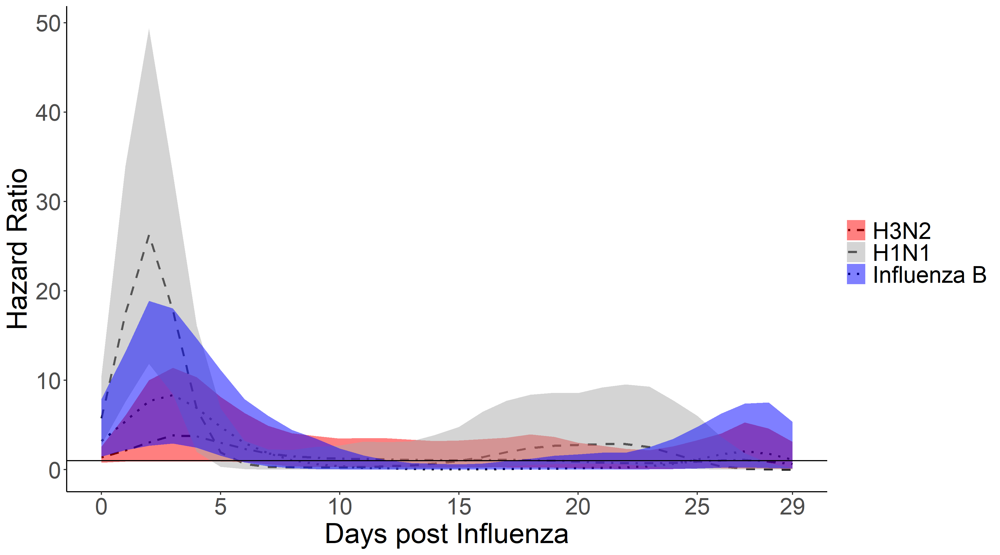

<!-- 
 -->
<!-- 
 -->

{width=50%}
<!-- 
 -->

**Individual-Level Association of Influenza Infection with Subsequent  Pneumonia: A Case-Control And Prospective Cohort Study**

**John Kubale**, Guillermina Kuan, Lionel Gresh, Sergio Ojeda, Amy Schiller, Nery Sanchez, Roger Lopez, Eduardo Azziz-Baumgartner, Steph Wraith, Eva Harris, Angel Balmaseda, Jon Zelner, Aubree Gordon

<!-- * * * -->
<!-- 
 -->

[<button type="button" class="btn btn-outline-dark mb-2">PubMed</button>](https://pubmed.ncbi.nlm.nih.gov/32717069/)
[<button type="button" class="btn btn-outline-dark mb-2">PDF</button>](pubs/kubale_cidpneumo2020.pdf)

