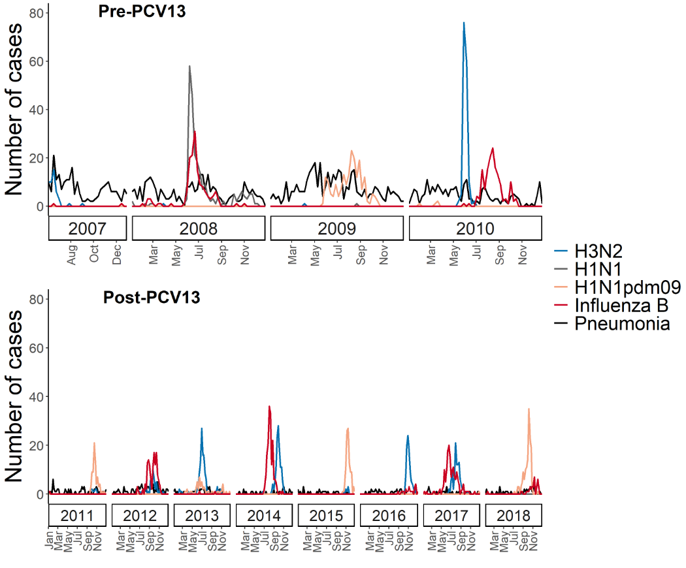

<!-- 
 -->
<!-- 
 -->

{width=50%}
<!-- 
 -->

**Pneumonia following symptomatic influenza infection among Nicaraguan children before and after introduction of the pneumococcal conjugate vaccine**

**John Kubale**, Angel Balmaseda, Nery Sanchez, Roger Lopez, Lionel Gresh, Sergio Ojeda, Eva Harris, Guillermina Kuan, Jon Zelner, Aubree Gordon

<!-- * * * -->
<!-- 
 -->

[<button type="button" class="btn btn-outline-dark mb-2">PubMed</button>](https://pubmed.ncbi.nlm.nih.gov/33351091/)
[<button type="button" class="btn btn-outline-dark mb-2">PDF</button>](pubs/kubale_jid2020.pdf)

