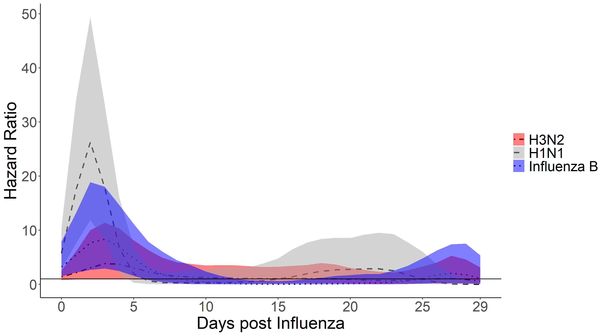

```{r setup, include=FALSE}
knitr::opts_chunk$set(echo = FALSE)
library(rmarkdown)
library(knitr)

```

[<font size="4">Individual-Level Association of Influenza Infection with Subsequent  Pneumonia: A Case-Control And Prospective Cohort Study</font>](https://pubmed.ncbi.nlm.nih.gov/32717069/)  
<font size="2">**John Kubale**, Guillermina Kuan, Lionel Gresh, Sergio Ojeda, Amy Schiller, Nery Sanchez, Roger Lopez, Eduardo Azziz-Baumgartner, Steph Wraith, Eva Harris, Angel Balmaseda, Jon Zelner, Aubree Gordon</font>
<aside>{width=100%}</aside>


[<font size="4">Assessing the Incidence of Symptomatic Respiratory Syncytial Virus Illness Within a Prospective Birth Cohort in Managua, Nicaragua</font>](https://pubmed.ncbi.nlm.nih.gov/31257406/)  
<font size="2">**John Kubale**, Guillermina Kuan, Lionel Gresh, Sergio Ojeda, Eduardo Azziz-Baumgartner, Nery Sanchez, Roger Lopez, Eva Harris, Angel Balmaseda, Aubree Gordon</font>
<aside>{width=100%}</aside>


[<font size="4">Simulation models predict that school-age children are responsible for most  human-to-mosquito Plasmodium falciparum transmission in southern Malawi</font>](https://pubmed.ncbi.nlm.nih.gov/29615044/)    
<font size="2">Jenna E Coalson, Lauren M Cohee, Andrea G Buchwald, Andrew Nyambalo, **John Kubale**, Karl B Seydel, Don Mathanga, Terrie E Taylor, Miriam K Laufer, Mark L Wilson</font>

  
[<font size="4">Analyses of infectious disease patterns and drivers largely lack insights from social epidemiology: contemporary patterns and future opportunities</font>](https://pubmed.ncbi.nlm.nih.gov/27799618/)    
<font size="2">Grace A Noppert, **John T Kubale**, Mark L Wilson</font> 


